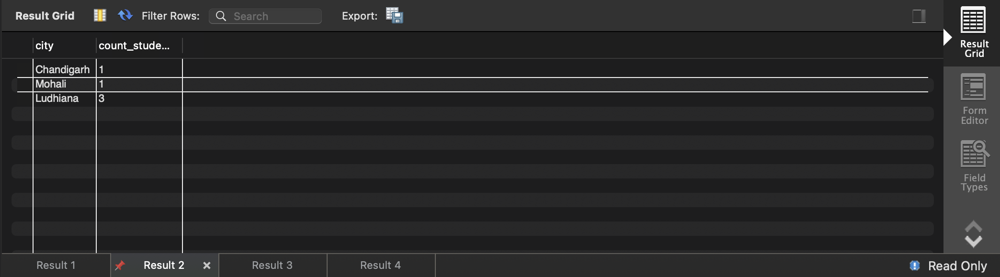
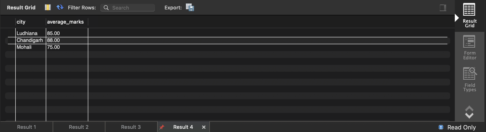

# SQL Practical – Aggregate Functions and GROUP BY

## Experiment
To study and implement SQL aggregate functions using `GROUP BY`, `HAVING`, and `ORDER BY` clauses on a Students database table.

---

## Objective
- To understand the use of SQL aggregate functions
- To perform grouping of records using the `GROUP BY` clause
- To filter grouped data using the `HAVING` clause
- To sort aggregated results using the `ORDER BY` clause
- To gain hands-on experience with MySQL Workbench

---

## Practical / Experiment Steps
1. Create a Students table with required attributes.
2. Insert student records into the table.
3. Count the number of students in each city.
4. Sort cities based on the number of students.
5. Identify cities having at least three students.
6. Calculate the average marks of students city-wise.
7. Execute all queries and verify the output.

---

## Procedure of the Experiment
1. Start the system and log in.
2. Open **MySQL Workbench**.
3. Create a new SQL script.
4. Write the `CREATE TABLE` command.
5. Insert records using `INSERT INTO` statements.
6. Execute `SELECT` queries with aggregate functions.
7. Apply `GROUP BY`, `HAVING`, and `ORDER BY` clauses.
8. Observe and verify the output.
9. Save the work and take screenshots.

---

## Input / Output Details and Screenshots

## 4. Procedure of the Practical

Follow these sequential steps to execute the experiment:

### (i) Start the System and Open DBMS
- Power on the computer and log in
- Open the Database Management System (SQL Server / MySQL / Oracle)
- Ensure you have access to create and modify tables

### (ii) Create or Select the Required Database
- Create a new database or select an existing one
- Verify the database is active before proceeding

### (iii) Create the Students Table
```sql
DROP TABLE IF EXISTS Students;
CREATE TABLE Students (
    id INT PRIMARY KEY,
    name VARCHAR(50),
    city VARCHAR(30),
    marks INT
);

```
- Execute the command to create the table with proper data types
- Verify table structure and constraints

### (iv) Insert Student Records
```sql
INSERT INTO Students VALUES (1, 'Shivam', 'Ludhiana', 85);
INSERT INTO Students VALUES (2, 'Jaskaran', 'Ludhiana', 78);
INSERT INTO Students VALUES (3, 'Yuvraj', 'Ludhiana', 92);
INSERT INTO Students VALUES (4, 'Kartik', 'Chandigarh', 88);
INSERT INTO Students VALUES (5, 'Anhad', 'Mohali', 75);
```
- Execute all INSERT statements sequentially
- Verify each record is inserted successfully

### (v) How many students belong to each city.
```sql
SELECT city, COUNT(*) AS count_students
FROM Students
GROUP BY city;
```

- Execute the query to view all inserted records
- Verify the data appears correctly in the result set

### (vi) Sort Cities Based on Student Count.
```sql
SELECT CITY, COUNT(*) AS NO_OF_STUDENT
FROM Students
GROUP BY City
ORDER BY NO_OF_STUDENT ASC
```

- Execute the query to count students by city
- Observe how GROUP BY organizes data by city
- Note the ORDER BY sorts results by count in ascending order
- Results show each city with the number of students

### (vii) Find Cities Having at Least Three Students.
```sql
SELECT city, COUNT(*) AS count_students
FROM Students
GROUP BY city
HAVING COUNT(*) >= 3;
```

### (viii) Calculate the average marks of students in each city.
```sql
SELECT city, ROUND(AVG(marks), 2) AS average_marks
FROM Students
GROUP BY city;
```


## Learning Outcome
After completing this experiment, the student is able to:
- Use SQL aggregate functions such as COUNT and AVG
- Apply GROUP BY and HAVING clauses effectively
- Analyze data using SQL queries
- Sort and filter grouped results
- Gain practical exposure to MySQL Workbench

---

## Tools Used
- MySQL Workbench
- GitHub
